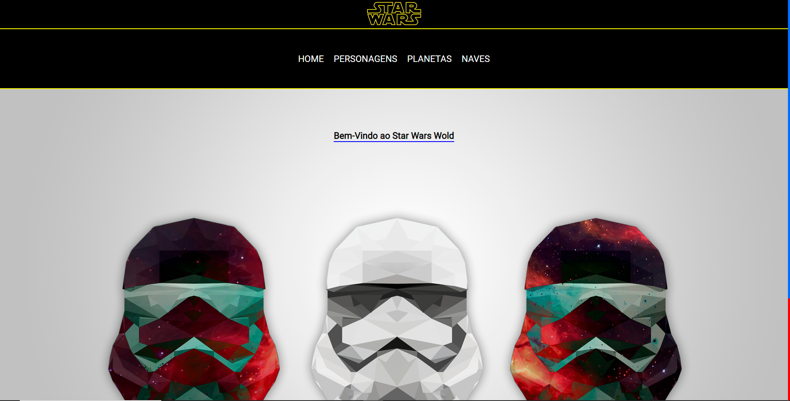

## STAR WARS API
## Sobre o Projeto

A atividade tem uma dinamica de comsumir alguma API publica e utilizar ela para fazer um site com tudo que a gente aprendeu nas ultimas aula, como  web componets e routers.

- [Link do site](https://chic-cactus-d0f226.netlify.app/)
- [Link da api ](https://swapi.dev/)

 

## Tecnologias utilizadas

- Javascript
- HTML
- CSS
- Figma
- todoist
 

## Deploy

### Deploy Front-End

Realizado com o [Netlify](https://www.netlify.com/)

 

## Repositorios

### Confira também os repositorios:

[Front-End](https://github.com/GustavoSenai10/APIs-publicas) - Você está aqui 🚩

[Figma](https://www.figma.com/file/t2KkspVVUsjyHONxb97LLL/SWAPI?type=design&node-id=0-1&t=Ol50RbUZmcuVksYb-0)

 

## Colaboradores

|                                                                                                             |                                                                                                                                                              |
| ----------------------------------------------------------------------------------------------------------- | ------------------------------------------------------------------------------------------------------------------------------------------------------------ |
|  |   |